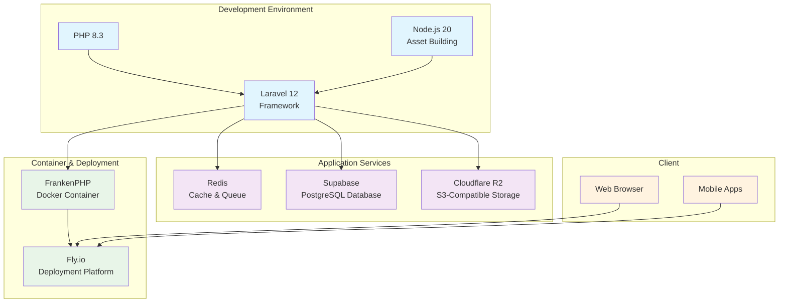

# Palm CMS

> Note: This is a technical skill assessment held by Palmcode for Senior Laravel Developer.

Headless CMS with TALL Stack. It covers:

- Manage Posts
- Manage Categories
- Manage Pages
- Manage Media
- Manage Users

This project deploy on [Fly.io](https://fly.io) and can be access with these accounts:

```
# Admin role
Email: admin@cms.test
# Editor role
Email: editor@cms.test
# Author role
Email: author@cms.test
```

All accounts can be accessed with password: `password`.

API documentation provided in URL: `https://palm-cms.fly.dev/docs/api`

## Deployment Diagram



## Prerequisites

- Laravel version 12
- PHP version 8.3
- Redis
- SQLite or Postgresql
- NodeJS
- Cloudflare account to create Cloudflare R2 Bucket (S3 compatible)

To make better development experience, use Herd or Laragon.

## How to run?

This project use Laravel version 12 and use PHP version 8.3.

1. Clone this project.
2. Go to project and copy environment template.

```sh
cp .env.example .env
```

3. Run `composer install` and `npm install` to install dependencies

```sh
composer install
npm install
```

4. Adjust environment for database connection, s3, and redis.

5. Run artisan migrate and artisan seeder.

```sh
php artisan migrate
php artisan db:seed
```

6. Run `composer run dev` command to access project in `http://localhost:8000`
